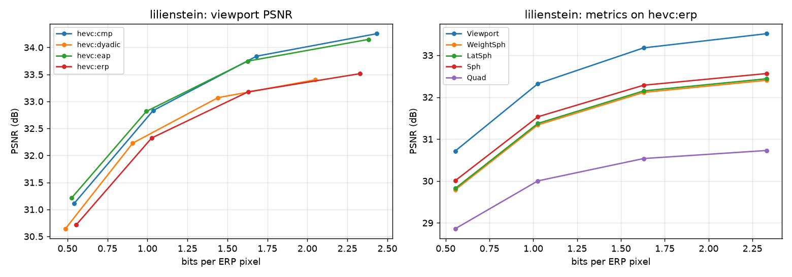

# Évaluer le codage d'images 360° sur la sphère

Ce projet réimplémente le cadre d'évaluation proposé par **Yu, Lakshman et Girod** dans
*A Framework to Evaluate Omnidirectional Video Coding Schemes* (IEEE ISMAR 2015, Stanford),
et l'applique au codec **HEVC** (x265, codage intra).

## Le problème

Une image 360° est une sphère, mais les codecs ne savent coder que des rectangles. On la
projette donc sur un plan, le plus souvent en **équirectangulaire (ERP)**, qui suréchantillonne fortement les pôles (facteur 1/cos φ). Deux conséquences :

1. le **PSNR calculé sur le plan** surpondère les pôles, que l'utilisateur regarde peu ;
2. le codec dépense des bits sur des zones sur-représentées.

L'article propose de mesurer la qualité **sur ce que voit l'utilisateur** (PSNR de viewport, à partir des mouvements de tête) et montre qu'un **S-PSNR pondéré** par des statistiques de
mouvements de tête l'approche sans connaître la trajectoire exacte. Il compare ensuite
plusieurs projections avec ces métriques.

## Ce qui est implémenté

| Étape | Contenu | Fichiers |
|---|---|---|
| 1. Projections | ERP, equal-area (EAP), dyadique, cubemap (CMP) ; génération par la sphère (Fig. 2), interpolation bicubique | `omni360/projections.py`, `omni360/sampling.py` |
| 2. Métriques | PSNR de viewport (Éq. 1 à 3), S-PSNR, S-PSNR pondérés (WeightSph, LatSph), Quad, BD-rate | `omni360/viewport.py`, `omni360/metrics.py`, `omni360/bdrate.py` |
| 3. HEVC | x265 intra aux QP 22, 27, 32, 37 sur chaque projection (Tableau 1, Fig. 6) | `scripts/run_hevc.py`, `omni360/hevc.py` |
| Analyse | tableaux BD-rate (Tableaux 1 et 2), courbes débit/distorsion (Fig. 6 et 7) | `scripts/report.py` |

## Installation (Windows)

```powershell
uv venv --python 3.12 .venv        # ou : py -3.12 -m venv .venv
.venv\Scripts\activate
pip install -r requirements.txt
pip install -e .
pytest                              # 32 tests que je vais faire
```

FFmpeg avec x265 est fourni par `imageio-ffmpeg`, rien d'autre à installer.

## Données

Placez des panoramas **équirectangulaires 2:1** (4K ou plus) dans `data/test/`. Les HDRI de
[Poly Haven](https://polyhaven.com/hdris) (licence CC0) existent en JPG tonemappé et conviennent bien. Une dizaine d'images suffit.

Sans données, le mot `synthetic` remplace un fichier : il génère une mire de test.

## Utilisation

```powershell
# 1. Projections, viewports, Fig. 1 et Fig. 5  ->  results/demo/
python scripts/demo_projections.py data/test/mon_panorama.jpg

# 3. HEVC sur les 4 projections  ->  results/hevc.csv
python scripts/run_hevc.py data/test

# Tableaux BD-rate et courbes  ->  results/report.md, results/rd_*.png
python scripts/report.py results/hevc.csv --reference hevc:erp
```

## Choix et limites

* **Images fixes** (codage intra) plutôt que vidéos, pour garder des temps de calcul raisonnables ; le cadre d'évaluation est le même.
* **Mouvements de tête synthétiques** (lacet uniforme, tangage gaussien autour de l'horizon).
  L'article utilise de vraies trajectoires (10 utilisateurs, Oculus Rift DK2). Des données
  réelles comme Salient360! peuvent être passées sous forme de tableau (lacet, tangage, roulis).
* **Résolutions réduites** par défaut : vérité terrain 3072×1536 et images codées 2048×1024
  (l'article : 6K×3K et 4K×2K). Le rapport 1,5 entre les deux est conservé.
* **Projection dyadique** : les deux bandes polaires (à demi-résolution horizontale) sont
  rangées côte à côte au-dessus de la bande équatoriale, soit 82 % des pixels de l'ERP.
* **Cubemap** en 3×2, avec un budget de pixels égal à celui de l'ERP.
* Le **débit** est exprimé en bits par pixel de la grille ERP codée, identique pour toutes
  les projections afin de pouvoir les comparer.

## Résultats

### Protocole

* **8 panoramas** de Poly Haven (8192×4096, CC0) : `artist_workshop`, `empty_warehouse_01`,
  `kiara_1_dawn`, `lilienstein`, `pond_bridge_night`, `rainforest_trail`, `shanghai_bund`,
  `wide_street_01`.
* Vérité terrain en 3072×1536, images codées en 2048×1024, x265 intra (preset `medium`) aux
  QP 22, 27, 32 et 37 : 128 codages au total, mesurés sur la luminance.
* PSNR de viewport sur 30 orientations de tête synthétiques (viewports 1024×1024, champ de
  vision de 90°). S-PSNR sur 655 362 points. Les poids de WeightSph et LatSph viennent de
  500 *autres* orientations, comme l'article qui les estime sur d'autres utilisateurs.
* Environ 2 h 15 de calcul sur mon PC.(Peut-être accéléré ailleurs)

### Tableau 1 : économie de débit par rapport à l'ERP

BD-rate de chaque projection par rapport à l'ERP, mesuré avec le PSNR de viewport. Une
valeur négative signifie moins de bits que l'ERP pour la même qualité vue par l'utilisateur.

| Image | Cubemap | Dyadique | Equal-area |
|---|---|---|---|
| artist_workshop | −19,44 % | +0,69 % | −29,79 % |
| empty_warehouse_01 | −40,73 % | −2,99 % | −36,16 % |
| kiara_1_dawn | −21,53 % | −6,40 % | −30,88 % |
| lilienstein | −19,99 % | −7,46 % | −23,75 % |
| pond_bridge_night | −25,82 % | +5,19 % | −30,95 % |
| rainforest_trail | n/a | −16,70 % | n/a |
| shanghai_bund | −11,93 % | +3,01 % | −28,69 % |
| wide_street_01 | −14,02 % | +6,52 % | −50,27 % |
| **Moyenne** | **−21,92 %** | **−2,27 %** | **−32,93 %** |

* **Equal-area (−33 %) et cubemap (−22 %)** demandent moins de bits que l'ERP sur toutes les
  images où le calcul est possible (7 sur 7).
* **Dyadique (−2 %)** : pas de gain net, et des résultats partagés selon les images. Sans
  `rainforest_trail`, la moyenne tombe à −0,2 %.
* Pourquoi l'equal-area gagne autant : elle retire des lignes aux pôles pour les donner à
  l'équateur, où elle a environ π/2 ≈ 1,57 fois plus de lignes que l'ERP. Or les mouvements
  de tête simulés restent surtout près de l'horizon. Ce classement dépend donc du modèle de
  mouvements de tête et pourrait changer avec de vraies trajectoires.

### Tableau 2 : quelle métrique s'approche le plus du PSNR de viewport ?

Écart entre la courbe débit/qualité de chaque métrique et celle du PSNR de viewport, sur les
mêmes images codées (|BD-rate|, plus c'est bas, mieux c'est).

| Projection | WeightSph | LatSph | Sph | Quad |
|---|---|---|---|---|
| Cubemap | 19,50 % | 19,30 % | 37,84 % | 14,73 % |
| Dyadique | 20,79 % | 20,65 % | 30,60 % | 62,63 % |
| Equal-area | 23,62 % | 23,31 % | 68,34 % | 95,16 % |
| ERP | 19,66 % | 19,55 % | 32,86 % | 83,34 % |
| **Moyenne** | **20,89 %** | **20,70 %** | **42,41 %** | **63,96 %** |

* En moyenne, **les S-PSNR pondérés par les mouvements de tête (WeightSph, LatSph) sont les
  plus proches** du PSNR de viewport, loin devant le S-PSNR simple (Sph) et le PSNR sur le
  plan (Quad). C'est la conclusion principale de l'article. Seule exception : sur la cubemap,
  Quad est un peu plus proche.
* WeightSph et LatSph donnent presque le même résultat. C'est attendu ici : le lacet simulé
  est uniforme, donc la densité de regard ne dépend pas de la longitude, et la moyenner selon
  la longitude (LatSph) ne perd rien.
* Les écarts restent élevés (environ 21 %), parce que le PSNR de viewport est systématiquement
  plus haut que WeightSph, de 0,3 à 0,4 dB en moyenne selon la projection. Une partie vient de
  la définition : le PSNR de viewport est une **moyenne de PSNR**, alors que WeightSph est le
  **PSNR d'une erreur moyenne**. Les vues presque sans erreur, comme le ciel, tirent la moyenne
  des dB vers le haut. Sur `lilienstein` (ERP, QP 27), les 30 viewports vont de 30,4 à 36,9 dB,
  et cet effet explique 0,33 dB sur un écart total de 1,07 dB. Le reste n'est pas expliqué ;
  le petit nombre de viewports (30) est une piste, à vérifier avec `--viewports 100`.

### Exemple de courbes



À gauche, le PSNR de viewport des quatre projections : l'equal-area et la cubemap sont
au-dessus de l'ERP à débit égal. À droite, toutes les métriques mesurées sur l'ERP. Les
courbes des huit images sont produites par `scripts/report.py` dans `results/rd_*.png`.

### Cas particulier : `rainforest_trail`

Sur cette image de feuillage très dense, la qualité bouge à peine avec le QP : le PSNR de
viewport en ERP passe de 21,2 à 20,8 dB pendant que le débit descend de 5,0 à 2,0 bits par
pixel. Le feuillage est plus fin que ce que 2048 pixels de large peuvent représenter : la perte
vient surtout de la réduction de résolution avant le codage, pas du codec. Ses courbes ne se
recoupent pas avec celles de l'ERP, d'où les « n/a » : le BD-rate ne peut pas être calculé.
Pour la même raison, son −16,70 % en dyadique n'est pas fiable. Les moyennes cubemap et
equal-area du Tableau 1 portent donc sur 7 images.

## Références

* M. Yu, H. Lakshman, B. Girod, *A Framework to Evaluate Omnidirectional Video Coding Schemes*, IEEE ISMAR 2015.
* G. Bjøntegaard, *Calculation of average PSNR differences between RD-curves*, ITU-T VCEG-M33, 2001.
